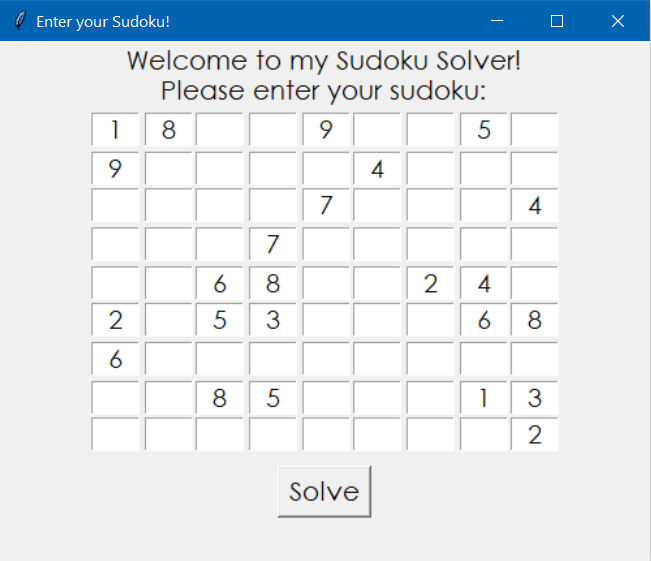
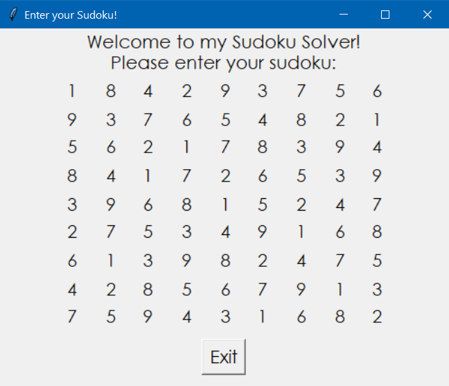

# AI-Sudoku-Solver

This project is a full scale implementation of an automated Constraint Satisfacation solver for Sudoku. It uses the following principles for the implementation:
- Arc Consistency functions
- Backtracking search
- Data Plotting and File Handling

## Arc Consistency functions
These functions simplify the problem by reducing the domain of the variables before or while the solution is in progress. As per its wording, it ensures the data selected is consistent with the constraints established in the problem. 

## Backtracking search
Backtracking is an algorithm used to examine all possible configurations of a state space. In this case, we analyze the state space of the 9x9 sudoku and **backtrack** when a valid solution is not possible. It is the core algorithm for solving Sudoku since it is a constraint satisfaction problem (a problem where to assign values to a set of variables, we must abide by certain constraints).

## Data Plotting and File Handling 
The data for the sudoku is fetched from the array of sudoku provided and is solved using the Constraint Satisfaction solver. A graph implementation using `matplotlib` and `numpy` helps view statistics about efficiency and time taken to generate the solution.

## GUI Implementation
A graphical user interface (GUI) has been implemented using `Tkinter` in display.py. It allows the user to enter their sudoku and request for it to be solved and generates when the implementation is run using `main.py`. Attached screenshots:

Entering NY Times hard Sudoku for April 1st:

Solved sudoku:

# How to run the implementation!
Two files containing sudoku problems have been provided. `tutorial_problem.txt` contains one problem whereas `top95.txt` contains 95 sudoku problems which are solved by the program. In order to run either of the files, the designated code can be edited in `main.py`. 
 Please run `pip install -r requirements.txt` prior to running main.py to install the required libraries.
 `main.py` can then be run to execute the Sudoku Solver!
